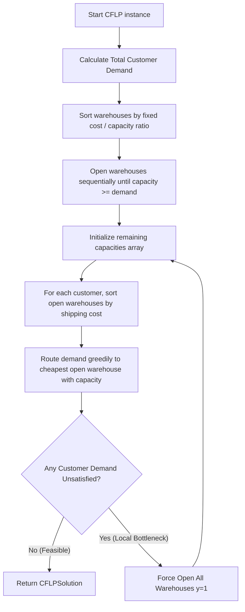

# Heuristic Optimization Design: Nearest Feasible Facility Baseline Solver

This document outlines the algorithmic flow and design specifications of our **Nearest Feasible Facility Heuristic** implemented in `src/baseline_solver.py`.

---

## 1. Structured Solution Representation (`CFLPSolution`)

To decouple candidate layouts from specific optimization solvers, we design a unified `CFLPSolution` class:
*   **Facility Opening Status ($y_i$)**: Encapsulated as a 1D NumPy binary array `y` of length $m$.
*   **Customer Flow Allocation ($x_{ij}$)**: Encapsulated as a 2D NumPy continuous matrix `x` of shape $(n, m)$.
*   **Continuous-to-Discrete Helper (`convert_flow_to_allocations`)**:
    For each customer $j$, we extract the primary supplying facility $i$ using a row-wise maximum coordinate search:
    $$\text{primary\_facility}_j = \arg\max_{i \in I} x_{ij}$$
    This maps continuous flow allocations into a discrete index array, laying the critical foundation for GA chromosome validation and crossover checks.

---

## 2. Nearest Feasible Facility Algorithmic Flow

The `GreedyBaselineSolver` operates in three modular stages to construct a valid, physically feasible solution:

### Step 1: Greedy Facility Selection ($y$)
To minimize fixed costs, we sort all candidate warehouses by their cost-to-capacity efficiency ratios:
$$\text{efficiency}_i = \frac{f_i}{s_i}$$
We open facilities sequentially in ascending order of their efficiency ratios until their cumulative storage capacity is strictly greater than or equal to the total network customer demand:
$$\sum_{i \in \text{open}} s_i \ge \sum_{j \in J} d_j$$
This guarantees that the network has enough physical capacity to serve all customers.

### Step 2: Nearest Feasible Facility Assignment ($x$)
Given the active warehouse status vector $y$, we initialize a `remaining_capacity` vector representing the available space at each warehouse. For each customer $j = 1 \dots n$:
1.  We extract all open warehouses and sort them in ascending order of their unit transportation cost to customer $j$:
    $$\text{sorted\_warehouses}_j = \text{sorted}\left(\{i \in I \mid y_i = 1\}, \text{key} = \lambda i: c_{ij}\right)$$
2.  We route customer $j$'s demand $d_j$ to these warehouses in sorted order. For the cheapest available warehouse $i$:
    $$\text{allocated\_flow} = \min\left(\text{demand\_left}, \text{remaining\_capacity}_i\right)$$
    $$x_{ji} = \text{allocated\_flow}$$
    $$\text{remaining\_capacity}_i = \text{remaining\_capacity}_i - \text{allocated\_flow}$$
    $$\text{demand\_left} = \text{demand\_left} - \text{allocated\_flow}$$
3.  We repeat this process until customer $j$'s demand is completely satisfied ($\text{demand\_left} = 0$).

### Step 3: Feasibility Safeguard (Capacity Extension)
Because greedy customer-facility matching can lead to localized capacity bottlenecks (where the sum of capacities is sufficient, but individual customers are blocked from routing due to greedy matching conflicts), the solver includes a robust fail-safe. If any customer demand remains unsatisfied at the end of Step 2, the solver falls back to **forcing all facilities open** ($y_i = 1$ for all $i$) and rerunning the assignment loop. This mathematically guarantees that a physically feasible baseline solution is always generated.

---

## 3. Heuristic Solver Performance Logs (`cap41.txt`)

Running `src/verify_phase2.py` generated the following benchmark results for the baseline heuristic on `cap41.txt` ($16 \times 50$, capacity $5,000$):

*   **Active Warehouses Set**: `[0, 1, 2, 3, 4, 5, 6, 7, 8, 9, 10, 11]` (12 / 16 open)
*   **Overhead Fixed Cost**: **\$82,500.00**
*   **Variable Transportation Cost**: **\$5,132,046,242.76**
*   **Total Heuristic Cost ($Z$)**: **\$5,132,128,742.76**
*   **Feasibility Check**: **PASS** (100% feasible, zero violations)

---

## 4. Connection to Future Genetic Algorithms

This baseline optimization stack directly benefits our upcoming evolutionary search engine:

1.  **Feasibility Repair Operator**: Random mutations in a Genetic Algorithm's chromosome ($y$) can easily lead to infeasible structures (e.g. fewer than 12 open warehouses). We can use `is_feasible` from our checker to identify invalid chromosomes, and use our **Nearest Feasible Heuristic** to dynamically assign customer demands, repair flows, and return a valid fitness score.
2.  **Smart GA Initialization**: Instead of initializing the GA population completely randomly, we can inject a few highly efficient baseline heuristic solutions (like our `GreedyBaselineSolver` output) into the initial population. This "seeding" technique jump-starts evolutionary search convergence, helping the GA locate optimal regions much faster.
3.  **Active Learning Surrogates**: The structured `CFLPSolution` will serve as the core data serialization class, storing binary status matrices and exact objective scores to generate high-quality datasets for training the Random Forest regressor.
