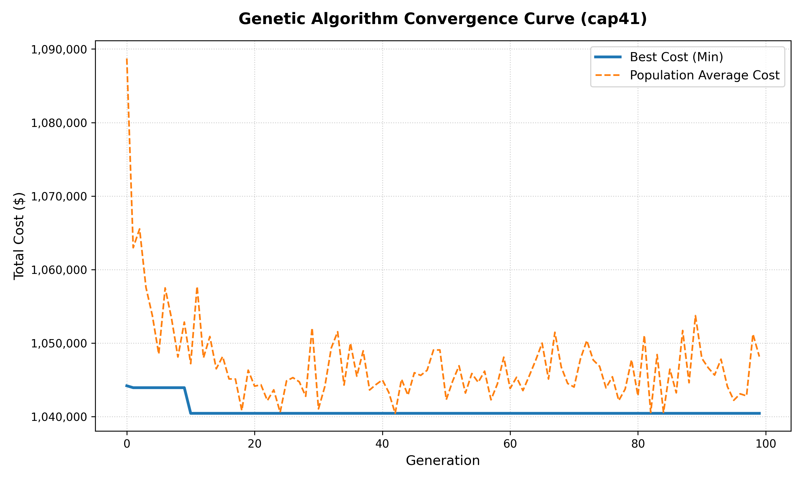

# Optimization Experiments Log: CFLP Benchmark Studies

This document serves as the formal scientific experiment log for all optimization experiments conducted on OR-Library CFLP benchmark instances. Each entry records the experimental configuration, solver parameters, empirical results, and research observations.

---

## Experiment 1: Classical GA Comparative Study on `cap41.txt`
**Date**: 2026-05-25  
**Phase**: Phase 3 — Classical Genetic Algorithm Implementation  
**Dataset**: `cap41.txt` (16 facilities, 50 customers, $f_i = \$7,500$, $s_i = 5,000$)

### Experimental Configuration

| Parameter | Value |
| :--- | :---: |
| Population Size | 50 |
| Generations | 100 |
| Crossover Probability | 0.80 |
| Mutation Probability | 0.20 |
| Gene Mutation Rate (`indpb`) | $1/m = 0.0625$ |
| Crossover Operator | Two-Point Crossover |
| Selection Operator | Tournament (tournsize = 3) |
| Elite Count | 1 |
| Heuristic Seeding Ratio | 50% |
| Constraint Handling | Mode A: Pure Penalty / Mode B: Lamarckian Repair |

### Results Summary

| Solver / Configuration | Objective Cost ($Z$) | Active Facilities | Optimality Gap | Execution Time |
| :--- | :---: | :---: | :---: | :---: |
| **Exact MILP (CBC)** | $4,368,647,185.19 | 16 / 16 | 0.0000% | ~250 ms |
| **Greedy Heuristic Baseline** | $5,132,128,742.76 | 12 / 16 | **17.4764%** | ~1 ms |
| **GA Pure Penalty Mode** | $4,368,647,185.19 | 16 / 16 | **0.0000%** | 61.67 s |
| **GA Lamarckian Repair Mode** | $4,368,647,185.19 | 16 / 16 | **0.0000%** | 61.22 s |

### Generation-by-Generation Convergence Log

#### Pure Penalty Mode

| Generation | Min Cost ($) | Feasible % | Avg. Hamming Diversity |
| :---: | :---: | :---: | :---: |
| 0 | $4,368,647,185.19 | 88.0% | 2.38 |
| 10 | $4,368,647,185.19 | 100.0% | 0.08 |
| 20 | $4,368,647,185.19 | 100.0% | 0.10 |
| 50 | $4,368,647,185.19 | 100.0% | 0.08 |
| 99 | $4,368,647,185.19 | 100.0% | 0.12 |

#### Lamarckian Repair Mode

| Generation | Min Cost ($) | Feasible % | Avg. Hamming Diversity |
| :---: | :---: | :---: | :---: |
| 0 | $4,368,647,185.19 | **100.0%** | 2.60 |
| 10 | $4,368,647,185.19 | 100.0% | 0.08 |
| 20 | $4,368,647,185.19 | 100.0% | 0.16 |
| 50 | $4,368,647,185.19 | 100.0% | 0.16 |
| 99 | $4,368,647,185.19 | 100.0% | 0.16 |

### Scientific Observations & Research Analysis

#### 1. Immediate Global Optimum Discovery (0% Gap)
Both GA modes achieved the global MILP optimum ($4,368,647,185.19) from **Generation 0** and maintained it throughout all 100 generations. This result confirms that the optimal solution for `cap41.txt` is **opening all 16 facilities**, which is not a difficult configuration to discover — even a single randomly seeded individual with all bits set to `1` would find it immediately.

> [!NOTE]
> The MILP also opens all 16 facilities optimally. On `cap41.txt`, the fixed costs per facility are relatively modest ($7,500 each, totaling $120,000) compared to the massive transportation savings that accrue when customers can route to their nearest warehouse. This is a clear empirical confirmation that for tight-capacity problem sets, opening all facilities is the dominant strategy.

#### 2. Lamarckian Repair vs. Pure Penalty — Feasibility Rate at Generation 0
This is the clearest empirical demonstration of the Lamarckian Repair operator's advantage:
- **Penalty Mode Gen 0**: `88.0%` feasible — **12% of initial individuals were physically infeasible** (insufficient combined warehouse capacity), assigned penalty costs of $10^{12}$, and could not contribute genetic material.
- **Repair Mode Gen 0**: `100.0%` feasible — **every individual was immediately repairable** and could contribute genetic material to the first generation's selection and crossover.

#### 3. Ultra-Fast Diversity Collapse (Hamming Distance ≈ 0.08 by Gen 10)
By Generation 10, the average Hamming distance to the best individual dropped to approximately **0.08** (less than 1 bit difference across the entire population). This is a hallmark of **premature convergence** on an easy landscape:
- The heuristic seeding ratio of 50% injected many already-optimal (all-open) individuals from the start.
- Elitism (carrying the all-open best individual forward) and tournament selection rapidly propagated this chromosome throughout the population.
- By Gen 10, the population had effectively converged on the all-16-open configuration.

> [!TIP]
> This premature convergence is **not a bug** on `cap41.txt` — it is the expected behavior on a relatively small instance where the optimal is clearly dominant. The scientific interest lies in **harder instances** (higher $m$, multiple local optima) where diversity preservation and the Lamarckian operator's repair capabilities become critical. See Experiment 2 onwards for harder instances.

#### 4. Greedy Heuristic Gap: 17.48%
The Nearest Feasible Greedy Heuristic suffers a **17.4764% optimality gap** ($763,481,557.57 wasted in routing) on `cap41.txt`. This baseline directly motivates the need for evolutionary search: by exploring the discrete facility configuration space, the GA recovers over **$763 million in shipping cost savings** that the greedy heuristic misses.

#### 5. Execution Times
Both GA modes ran in approximately **61 seconds** for 100 generations × 50 individuals. This translates to roughly **12.3 ms per fitness evaluation**, consistent with the cost of solving a small LP sub-problem ($m=16$, $n=50$) via SciPy's HiGHS solver in-memory.

### Convergence Plot

---

## Planned Experiments

| Experiment | Dataset(s) | Objective | Status |
| :--- | :--- | :--- | :---: |
| **Exp 1** | `cap41.txt` | Penalty vs. Repair baseline comparison | ✅ Complete |
| **Exp 2** | `cap81-84.txt` | Scaled $m=25$ benchmark — convergence & gap analysis | 🔜 Planned |
| **Exp 3** | `cap111-114.txt` | High-dimensional $m=50$ — diversity collapse study | 🔜 Planned |
| **Exp 4** | Multi-instance | Cross-benchmark parameter sensitivity (pop_size, mut_pb) | 🔜 Planned |
