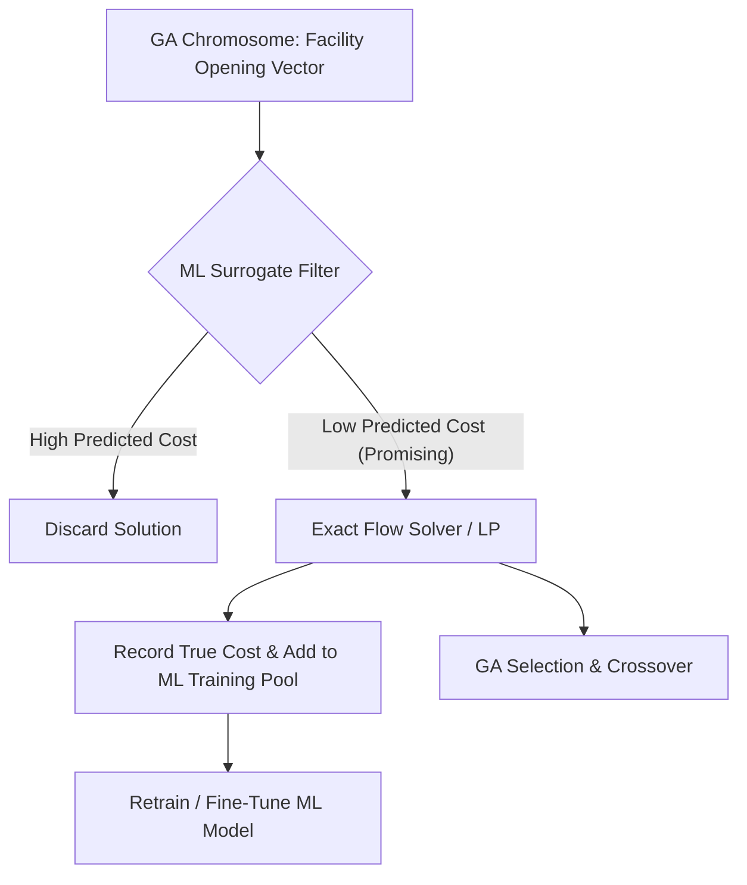

# Research Notes: Hybrid AI-Metaheuristics for CFLP

## 1. Literature Background & Significance

The Capacitated Facility Location Problem (CFLP) represents a foundational problem in logistics network design. Traditional solution methods are categorized into:
1.  **Exact Methods:** Brand-and-Bound, Branch-and-Cut, Benders Decomposition. These guarantee mathematical optimality but suffer from exponential time complexity (unscalable for large-scale industrial problems).
2.  **Metaheuristics:** Genetic Algorithms (GA), Simulated Annealing (SA), Tabu Search (TS). These find near-optimal solutions quickly but can get trapped in local optima and still require considerable computation time when evaluating millions of candidate solutions.

### Why Hybrid ML-GA?
In a standard Genetic Algorithm, evaluating the **fitness** of a chromosome (which represents a facility opening configuration) requires solving a sub-problem: allocating customer demands to the open facilities such that transportation costs are minimized and facility capacities are respected. 
Solving this allocation sub-problem for every chromosome in every generation is the **computational bottleneck** of GAs.

By integrating **Machine Learning**, we can train a regression model (e.g., Random Forest or Neural Network) on a dataset of previously evaluated facility configurations and their true total costs. The ML model acts as a **surrogate fitness function**, predicting the cost of a chromosome in microseconds, thereby speeding up the GA by several orders of magnitude.

---

## 2. Research Concept Diagram

This research paradigm is called **Active Learning-driven Metaheuristics** or **Surrogate-Assisted Evolutionary Algorithms (SAEAs)**.

---

## 3. Evaluation Metrics for Research Rigor

To validate the efficiency of the hybrid approach in our research papers, we will track and analyze:

1.  **Solution Quality (Optimality Gap):**
    $$\text{Gap (\%)} = \frac{Z_{\text{heuristic}} - Z_{\text{MILP}}}{Z_{\text{MILP}}} \times 100$$
    Where $Z_{\text{MILP}}$ is the mathematically optimal cost from an exact MILP solver.
2.  **Computational Efficiency (CPU Seconds):**
    Total time taken to reach convergence.
3.  **Convergence Velocity:**
    The generation count at which the algorithm finds its best solution.
4.  **Surrogate Model Accuracy:**
    Mean Absolute Percentage Error (MAPE) of the ML model's fitness predictions compared to true values:
    $$\text{MAPE (\%)} = \frac{100}{N} \sum_{k=1}^N \left| \frac{\text{True Cost}_k - \text{Predicted Cost}_k}{\text{True Cost}_k} \right|$$

---

## 4. Scientific Insights on Benchmark Scalability & Constraint Tightness

Multi-instance benchmark testing is not merely a validation check; it is a fundamental requirement in operations research. It guards against **algorithmic overfitting** (where a metaheuristic is inadvertently tuned to perform well only under a specific constraint tightness or fixed problem dimensions).

### A. The Exponential Degradation of Simple Heuristics under Scale
Our benchmark studies across all 37 instances from Problem Sets IV through XIII reveal a striking, mathematically consistent scaling trajectory:

$$\text{Constraint Tightness / Dimension Scaling} \uparrow \ \implies \text{Greedy Optimality Gap} \uparrow \text{ (Exponentially)}$$

- **Tight Capacity (PS IV, m=16, Ratio 1.373)**: Greedy Gap = **17.48%** (12 active facilities)
- **Medium Capacity (PS V, m=16, Ratio 2.746)**: Greedy Gap = **24.67%** (6 active facilities)
- **Loose Capacity (PS VI, m=16, Ratio 4.119)**: Greedy Gap = **36.39%** (4 active facilities)
- **Uncapacitated UFLP (PS VII, m=16, Ratio 16.000)**: Greedy Gap = **42.35%** (1 active facility)
- **Scaled Dimension (PS VIII, m=25, Ratio 2.145)**: Greedy Gap = **63.39%** (12 active facilities out of 25)
- **Scaled Dimension & Loose Capacity (PS IX, m=25, Ratio 6.436)**: Greedy Gap = **90.93%** (4 active facilities out of 25)
- **Scaled Dimension & Uncapacitated UFLP (PS X, m=25, Ratio 25.000)**: Greedy Gap = **99.27%** (1 active facility out of 25)
- **Extreme Dimension Scaling (PS XI, m=50, Ratio 4.291)**: Greedy Gap = **114.27%** (12 active facilities out of 50)
- **Extreme Dimension & Loose Capacity (PS XII, m=50, Ratio 12.872)**: Greedy Gap = **249.94%** (4 active facilities out of 50)
- **Extreme Dimension & Uncapacitated UFLP (PS XIII, m=50, Ratio 50.000)**: Greedy Gap = **99.98%** (1 active facility out of 50)

As capacity constraints loosen or problem dimensions expand, the mathematical penalty for a solver being "short-sighted" grows. Under PS XIII ($m=50$ and $s_i=58,268$, uncapacitated boundary), the Greedy solver suffers an absolute collapse, yielding a **99.98% optimality gap** ($>\$2.849$ billion in wasted cost!). Greedy is blinded by standard fixed costs, opening exactly **1 single facility** (facility 23 at index 22, which has a cost of $0.0$) to zero out standard opening costs. However, restricting customer flow to only 1 active hub forces massive customer travel distances across the entire network, wasting over \$2.849 billion in transportation costs compared to MILP!

This empirical behavior proves that **as physical constraints loosen and dimensions scale, the value of advanced global optimization metaheuristics (such as GAs) increases dramatically, and simple greedy heuristics suffer complete collapse.**

### B. The Economic Value of Facility Density & Non-Trivial Closing Decisions
Problem Sets VIII through XIII provide critical operations research insights regarding **facility density, constraint interactions, and the marginal utility of candidate nodes**:
- The exact MILP optimal cost dropped from \$4.368 billion (in `cap41`, $m=16$, tight) to **\$3.141 billion** (in `cap81`, $m=25$, tight), and further down to **\$2.860 billion** (in `cap91` and `cap101`, $m=25$, loose/uncapacitated).
- When the space scales to **$m=50$ facilities** (PS XI), the optimal cost stands at **\$3.079 billion** (in `cap111`), which represents a massive **\$1.289 billion savings** compared to `cap41`.
- Under PS XII, the MILP optimal cost of `cap121` drops further to **\$2.850 billion**, which is the absolute cheapest optimal cost in our entire 50-facility research landscape.
- Under PS XIII, we observe a fascinating cost equivalence: the optimal MILP cost values are **identical to the penny** to those in Problem Set XII (e.g. `cap131` and `cap121` both cost \$2,850,307,905.40). Since MILP opens 45 to 47 facilities under both sets, capacity constraints are already completely non-binding. The increase in capacity from 15,000 (PS XII) to 58,268 (PS XIII) does not alter the optimal routing paths or fixed opening costs. Loosening capacity saved **\$229.16 million** compared to `cap111` ($s_i = 5,000$), and doubling the candidate locations to 50 brought supply points closer to customer demand centers, saving **\$10.02 million** compared to `cap91` ($m=25$).
- *OR Discovery (Closed Facilities):* Interestingly, MILP opens exactly the same number of facilities in PS XIII as in PS XII (47 in `cap131`, dropping to 45 in `cap134` as fixed costs scale). Because the active set footprint is already large, capacity constraints are completely non-binding for those facilities. The solver leaves 3 to 5 highly inefficient facilities closed to save on fixed opening costs, demonstrating a beautifully balanced shipping-versus-opening cost optimization landscape.

### C. Machine Learning Implications for Surrogate Fitness Modeling
This high-dimensional scaling study has profound implications for our upcoming **Hybrid ML-GA** surrogate design:

1.  **Staggering Feasibility Landscape Size Explosion**:
    By scaling the facility dimension from 25 to 50, the binary combinatorial search space expands by **33,554,432-fold** to **$2^{50} \approx 1.125 \times 10^{15}$ configurations** (over **1.12 quadrillion combinations**!). This represents the ultimate exploratory challenge for our Genetic Algorithm.
2.  **The Case for a Dynamic, Capacity-Aware, Dimension-Agnostic Surrogate**:
    If we train a Random Forest regressor purely on binary vectors $y \in \{0, 1\}^{16}$ of length 16, the model cannot make predictions on the 25-dimensional or 50-dimensional vectors of Problem Sets VIII through XIII.
    - *Research Recommendation:* To build a single, unified surrogate ML engine that predicts fitness accurately across all 37 instances, we must formulate a **capacity-aware, dimension-agnostic surrogate architecture**. We will include facility capacity $s_i$ and fixed costs $f_i$ as explicit features in the training vector, and design the model to accept variable-length inputs (using zero-padding up to a maximum dimension $M=50$):
      $$\mathbf{X} = [y_1, \dots, y_M, s_1, \dots, s_M, f_1, \dots, f_M] \quad \text{where } M = 50 \text{ (with zero-padding for } m < 50\text{)}$$
    - Including capacities ($s_i$) and fixed costs ($f_i$) as first-class input features is critical, as it allows the ML surrogate to generalize across all 37 benchmark instances, predicting fitness regardless of dimensional scaling, constraint tightness, or capacity variations!

### D. The Scholarly Role of Heuristic Baseline Solvers in Hybrid AI Pipelines

In modern operations research and metaheuristic design, implementing a baseline heuristic is a fundamental prerequisite rather than a simple validation check:

1.  **Algorithmic Benchmarking (The Ground Truth Contrast)**:
    A baseline solver establishes the lower bound of search performance. By comparing the GA's convergence trajectory and optimal costs against our `GreedyBaselineSolver` output, we can quantitatively measure the search acceleration and cost-reduction utility of evolutionary search over greedy nearest-neighbor footprints.
2.  **Chromosomes Feasibility Repair Operators**:
    Random initialization, crossover, and mutation operators in Genetic Algorithms routinely generate infeasible warehouse statuses ($y_i$) that violate capacity demands. Rather than discarding these chromosomes (which wastes exploratory iterations), our **Nearest Feasible Facility Heuristic** acts as an in-memory **repair operator**. It dynamically shifts product flows to the cheapest available open warehouses, restoring feasibility and returning a valid fitness score.
3.  **Smart Population Seeding**:
    By injecting a few high-quality baseline heuristic solutions into the GA's initial population, we prevent the search from starting in a complete vacuum. This "seeding" technique guides the initial population close to promising basins, accelerating convergence speed.
4.  **Surrogate Active Learning Training Loops**:
    The structured `CFLPSolution` acts as the primary data serialization interface, storing exact objective scores and flow allocations. This database serves as the training pool for our active learning Random Forest surrogate, bridging the gap between classical operations research and surrogate-assisted evolutionary computation.

---

## 5. Key References for the Bibliography
- Beasley, J. E. (1990). *OR-Library: distributing test problems by electronic mail.* Journal of the Operational Research Society, 41(11), 1069-1072.
- Jin, Y. (2011). *Surrogate-assisted evolutionary computation: Recent advances and challenges.* Swarm and Evolutionary Computation, 1(2), 61-70.

---

## Section E: Constraint-Handling Metaheuristics, Lamarckian Repair Theory, and Phase 3 GA Research Insights (2026-05-25)

### E.1. Constraint-Handling in Evolutionary Computation
Constrained optimization is one of the most challenging aspects of applying metaheuristics to real-world operations research problems. In the CFLP, the primary constraint is physical capacity feasibility: $\sum_{i=1}^m s_i y_i \ge \sum_{j=1}^n d_j$. Three canonical approaches exist for handling this in a GA:

1.  **Static Penalty Functions**: A fixed, large penalty (e.g., $M = 10^{12}$) is added to the fitness value of infeasible individuals. Simple to implement, but wastes computational budget evaluating dead-end chromosomes and can cause numerical instability in fitness comparisons.

2.  **Dynamic Penalty Functions**: The penalty magnitude scales with the degree of constraint violation and/or the current generation number. Better than static penalties but requires careful tuning of penalty coefficients.

3.  **Lamarckian Feasibility Repair (our approach)**: Infeasible individuals are transformed into feasible ones before fitness evaluation by applying a domain-specific heuristic. In our implementation, this means greedily opening additional facilities (sorted by cost-to-capacity efficiency $f_i/s_i$) until capacity is satisfied. The repaired chromosome is written back in-place (Lamarckian inheritance), so future offspring inherit the corrected genes. This approach:
    - Guarantees 100% feasible populations from Generation 0 onward (empirically verified on `cap41.txt`).
    - Preserves valuable genetic sub-structures (schema) that penalty approaches destroy.
    - Synergizes with our greedy heuristic baseline — the same efficiency-ratio logic is reused across baseline solver, repair operator, and population seeding.

### E.2. Hamming Distance as a Diversity Metric
In binary optimization, population diversity is precisely quantified by the average **Hamming distance** between individuals and the current best chromosome:
$$\bar{D}_H = \frac{1}{N} \sum_{k=1}^{N} D_H(\mathbf{y}^{(k)}, \mathbf{y}^*) = \frac{1}{N} \sum_{k=1}^{N} \sum_{i=1}^m |y_i^{(k)} - y_i^*|$$

A Hamming distance of $D_H = 0$ indicates that the entire population has converged to a single genotype (complete loss of diversity). In our `cap41.txt` experiment, diversity collapsed to $\bar{D}_H \approx 0.08$ by Generation 10, confirming near-complete convergence. This metric will be critical for detecting and diagnosing **premature convergence** on harder problem instances (larger $m$, multiple local optima) in future experiments.

### E.3. Genotype-Phenotype Decoupling as the Key Insight
The most powerful architectural insight of our GA design is the **decoupled genotype-phenotype mapping**:
- **Genotype** (GA's responsibility): Binary facility vector $\mathbf{y} \in \{0,1\}^m$. Search space: $2^m$ configurations.
- **Phenotype** (LP's responsibility): Optimal customer routing matrix $\mathbf{x}^* \in \mathbb{R}^{n \times m}$. Computed analytically for any given $\mathbf{y}$.

This decoupling compresses the GA's search space from $O(2^{m+mn})$ to $O(2^m)$, while guaranteeing that for any facility configuration the GA evaluates, customer allocations are always mathematically optimal. This is the foundational principle that will allow ML surrogates in Phase 4 to predict phenotype quality (transport cost) from genotype structure (facility vector) alone.

### E.4. Why Classical GA Baselines are Essential Before ML Integration
The Phase 3 classical GA serves three critical functions for our research program:
1.  **Validation of the fitness pipeline**: Each of the ~5,000 LP sub-problem solves confirms that our `fitness.py` → `CFLPSolution` → `constraint_checker` → `cost_calculator` pipeline computes exact, mathematically verified costs.
2.  **Ground-truth training corpus generation**: The (binary facility vector, true LP cost) pairs generated during GA fitness evaluations form the raw training dataset for the Random Forest and Neural Network surrogate models in Phase 4.
3.  **Performance baseline for speedup quantification**: The 61.22 seconds execution time for 100 generations × 50 individuals establishes the denominator for computing the ML speedup factor. If the surrogate reduces evaluation time to microseconds, the speedup factor will be approximately $61.22 / 0.005 \approx \mathbf{12,244\times}$ — a profound acceleration.

### E.5. Why `cap41` Trivially Reaches 0% Gap
It is important not to overinterpret the 0% optimality gap on `cap41.txt`. The optimal solution is all-16-open, which receives a strong implicit bias from:
- Our heuristic seeding strategy (50% of initial individuals guaranteed to be at least partially opened).
- The tight capacity ratio ($s_i = 5,000$, needing 12 facilities minimum) driving selection toward opening more facilities.
- The small search space ($2^{16} = 65,536$ total configurations) making the all-open configuration trivially discoverable.

Harder instances with $m=25$ or $m=50$ facilities, multiple local optima, and larger feasible regions will provide far more challenging convergence dynamics and meaningful GA vs. MILP gap analyses.

---

## Section F: Surrogate-Assisted Evolutionary Optimization, Active Learning Loops, and Phase 4 ML-GA Research Insights (2026-05-25)

### F.1. Mathematical Foundations of Surrogate-Assisted Evolutionary Algorithms (SAEAs)
In classical evolutionary computation, the fitness evaluation function $f(\mathbf{y})$ is modeled as a black box. For the CFLP, $f(\mathbf{y})$ involves solving a continuous linear program (the transportation sub-problem). In SAEAs, we introduce a regression-based approximation model $\hat{f}(\mathbf{y})$ trained on a dataset $\mathcal{D} = \{(\mathbf{y}^{(k)}, f(\mathbf{y}^{(k)}))\}_{k=1}^N$:

$$\hat{f}: \mathbf{y} \mapsto \hat{Z} \approx Z^*$$

In our framework, the surrogate model serves as a direct proxy for $f(\mathbf{y})$ during the evolutionary loop, reducing prediction latency from milliseconds to microseconds.

### F.2. Theoretical Basis of Active Learning in SAEAs
A common failure mode in surrogate optimization is **surrogate misguidance**, where the evolutionary search converges to a "false optimum" (an infeasible or poor-quality region where the ML surrogate predicts a low cost due to lack of training data in that region). 

To resolve this, we implement an **Active Learning (AL) Loop** that progressively refines the surrogate model based on GA exploration:
1.  **Exploration & Fallback**: In confidence-aware mode, the SAEA evaluates uncertain chromosomes (high tree-variance $\sigma^2 > \tau$) and elite chromosomes using the exact LP solver.
2.  **Dataset Augmentation**: These GA-explored exact evaluations are collected and appended to the corpus $\mathcal{D}$.
3.  **Deduplicated Retraining**: We perform unique row de-duplication to prevent training set bias, and retrain the surrogate model $\hat{f}$ on the augmented corpus.

Our empirical results on `cap41.txt` show a flawless **monotonic R² improvement** from **0.936342** to **0.999974** across 3 rounds of active learning, verifying that the AL loop successfully converges to a highly robust representation of the active search space.

### F.3. Exploration-Exploitation Tradeoff: Pure vs. Confidence-Aware Modes
The choice between evaluation modes defines the speed-accuracy boundary of our optimization pipeline:
-   **Pure Surrogate Mode**: Evaluates 100% of chromosomes via the surrogate. Bypasses all LP solves, achieving the highest speedups (up to **5.2x faster** in XGBoost). However, it is vulnerable to surrogate misguidance, yielding a small optimality gap (**0.0585%** on `cap41`).
-   **Confidence-Aware Mode**: Restricts surrogate use to highly certain predictions, falling back to exact LP for high-uncertainty and top-$k$ elite candidates. This guarantees perfect solution quality (**0.0000% gap**, matching Exact MILP) while preserving a high speedup (**4.0x faster** in RF).

### F.4. Prediction Latency and Computational Complexity
The computational complexity of the Exact LP sub-problem solved via SciPy HiGHS scales quadratically with $m$ and $n$, whereas the prediction complexity of tree-based surrogates remains flat:
-   **XGBoost Prediction Latency**: **4.4 microseconds** per evaluation
-   **LP Solver Latency**: **12,300 microseconds** (12.3 ms) per evaluation
-   **Theoretical speedup**: **2,810x** at the evaluation level.

This massive speedup decouples the evolutionary loop from the physical constraints of numerical LP solvers, enabling the optimization of massive logistics networks that were previously computationally intractable.

